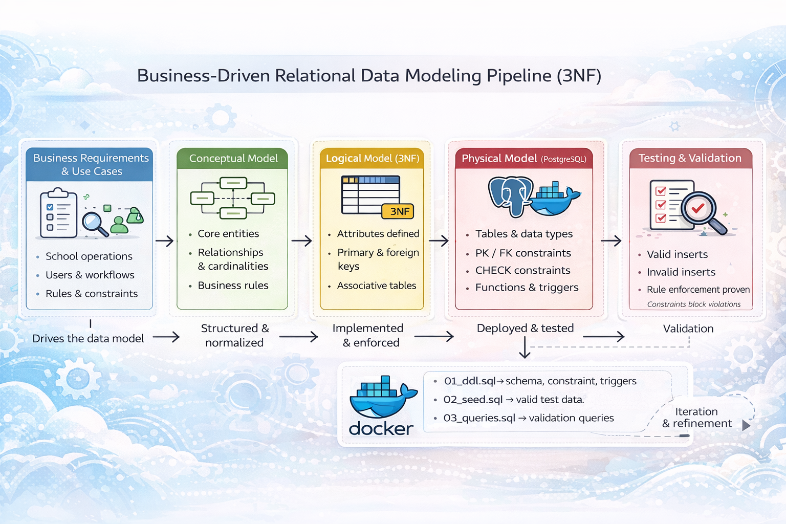

# Data Modelling 
This repository contains an end-to-end data modeling and database implementation for YrkesCo, a vocational school operating across multiple campuses in Sweden. The project replaces fragmented Excel-based administration with a normalized, scalable, and auditable PostgreSQL data model, designed to support both business stakeholders and technical consumers.

### 💻 Tech Stacks


### Repository Structure 

```
data_modelling_lab_aira_franco/
├── .venv/                         
├── assets/                        # Diagrams and images
├── test_python_docker/            # Docker + Python testing
│
├── yh_labb/                       # Main lab folder
│   ├── documentation/             # Business rules, documentations and notes
│   ├── models/                    # Conceptual, logical and physical models
│   └── sql/
│       ├── init/
│       │   ├── 01_ddl.sql         # Database schema
│       │   ├── 02_seed.sql        # Test data, populate data
│       ├── 03_queries.sql          # Demo queries
│       └── 04_insert_new_cohort.sql # Demo INSERT new values queries
│
├── .env                           # Environment variables
├── docker-compose.yml             # Docker setup
├── requirements.txt               # Python dependencies
├── .gitignore
├── 00_env_setup.md                # Repository Setup instructions
└── README.md
* All scripts are idempotent and safe to re-run.
```

### Table of Contents
- [File Structure](#file-structure)
- [Video](#video)
- [Deliverables](#deliverables)
- [⚡ Quick Start (Replicate This Project)](#-quick-start-replicate-this-project)
- [Prerequisites](#prerequisites)
- [Verification Checklist](#verification-checklist)
- [Conceptual & Logical Model Diagrams](#conceptual--logical-model-diagrams)
- [Documentation Index](#documentation-index)
- [Presentation PDF](#presentation-pdf)


### Project Pipeline



### Video
[](https://www.youtube.com/watch?v=L8Wg-WHX-T8)


### Deliverables
- Conceptual, logical, and physical data models
- PostgreSQL implementation with enforced business rules
- Dockerized execution environment
- SQL demo queries proving data integrity

----

## ⚡ Quick Start (Replicate This Project)
Use the steps below to run the same workflow end-to-end. Each step links to detailed guidance in `yh_labb/documentation/`.
All scripts are idempotent and safe to re-run.

1. **Prepare your local environment**
   - Follow [00_env_setup.md](00_env_setup.md) for required tooling (`git`, `docker`, `python`) and setup checks.

2. **Review project scope and modeling decisions**
   - Business context: [01_business_requirements.md](yh_labb/documentation/01_business_requirements.md)
   - Physical model assumptions: [02_physical_model_guide.md](yh_labb/documentation/02_physical_model_guide.md)
   - 3NF justification: [03_3NF_defense.md](yh_labb/documentation/03_3NF_defense.md)

3. **Start PostgreSQL with Docker**
   - Run from `yh_labb/`:
     ```bash
     docker compose up -d
     ```
   - Command reference: [04_docker_commands.md](yh_labb/documentation/04_docker_commands.md)

4. **Initialize and verify the database**
   - Schema and seed scripts are auto-loaded from `yh_labb/sql/init/` on first container start.
   - Validate with psql: [05_psql_commands.md](yh_labb/documentation/05_psql_commands.md)
   - Full implementation walkthrough: [06_docker_implementation.md](yh_labb/documentation/06_docker_implementation.md)

5. **Run example SQL checks**
   - Execute `yh_labb/sql/03_queries.sql` and optionally `yh_labb/sql/04_insert_new_cohort.sql` to reproduce demo outputs.

6. **Shut down services when done**
   ```bash
   docker compose down
   ```

## Prerequisites
- Docker + Docker Compose
- Git
- Python 3.x (used for companion testing scripts)
- A `.env` file configured for the PostgreSQL container

For setup details, use [00_env_setup.md](00_env_setup.md).

## Verification Checklist
After startup, you should be able to verify the environment with:

```bash
# 1) Containers are running
cd yh_labb && docker compose ps

# 2) Database is reachable
# (see detailed commands in documentation/05_psql_commands.md)

# 3) Demo queries execute
# Run yh_labb/sql/03_queries.sql against the running database
```

If something fails, consult:
- Docker troubleshooting and command variants: [04_docker_commands.md](yh_labb/documentation/04_docker_commands.md)
- End-to-end implementation notes: [06_docker_implementation.md](yh_labb/documentation/06_docker_implementation.md)

----

## Conceptual & Logical Model Diagrams 
#### Conceptual Model


| Entity                         | Description                                                                                                                                                                                              |
| ------------------------------ | -------------------------------------------------------------------------------------------------------------------------------------------------------------------------------------------------------- |
| 1. **Student**                    | A person enrolled at the school. A student belongs to exactly one class. Students do not enroll directly in programs or courses; enrollment is always mediated through a class.       |
| 2. **Class**                      | An approved, time-bound delivery of an education program (e.g. DE24, DE25). A class represents a specific approval round of a program, is assigned to one campus, and groups students studying together. |
| 3. **Program**                    | A two-year education offering consisting of multiple predefined courses. A program defines the curriculum and may be approved multiple times over different years, resulting in multiple classes.        |
| 4. **Course**                     | A unit of education with defined content, credits, and learning objectives. A course may belong to one program or exist independently as a standalone course. Courses are not directly owned by classes. |
| 5. **Campus**                     | A physical school location where classes are delivered. Each class is associated with exactly one campus.                                                                                                |
| 6. **Staff**                      | Internal employees of the school, such as program managers or administrative personnel. Each staff member operates under exactly one active staff contract at a time.                                    |
| 7. **Staff Contract**             | A time-bound employment agreement defining a staff member’s role, campus assignment, compensation, and employment period. Only one staff contract may be active per staff member at any time.            |
| 8. **Consultant**                 | External professionals engaged by the school to teach or support classes. Consultants operate under consultant contracts and may be associated with a consultant company.                                |
| 9. **Consultant Contract**        | A time-bound agreement defining a consultant’s assignment, compensation, campus affiliation, and contract period. Only one active contract may exist per consultant at a time.                           |
| 10. **Consultant Company**         | An external organization that employs or represents one or more consultants providing services to the school.                                                                                            |
| 11. **Private Details**            | A secured entity containing sensitive personal or company information, such as personal identity numbers and contact details. Access is restricted for privacy and compliance reasons.                   |
| 12. **Project Manager Management** | An assignment entity representing the responsibility of a staff member acting as program manager for education classes. It enforces managerial constraints between staff and classes.                    |
| 13. **Consulant Teach** | Represents the actual delivery of teaching: a consultant teaching a specific course to a specific class during a defined period. |
| 14. **Enrollment** | Represents a student’s registration in a specific class for a given academic term. Enrollment enforces business rules ensuring that a student is enrolled in either one program class or one standalone course per term, but not both. |

#### Logical Model


| Entity A                       | Entity B                       | Cardinality   | Description                                                                                                                              |
| ------------------------------ | ------------------------------ | ------------- | ---------------------------------------------------------------------------------------------------------------------------------------- |
| 1. **Staff**                      | **Staff Contract**             | 1 : 1         | Each staff member has exactly one active staff contract, and each staff contract belongs to exactly one staff member.                    |
| 2. **Staff Contract**         | **Campus**                       | N : 1           | Each staff contract is associated with exactly one campus, while a campus may have many staff contracts. |
| 3. **Consultant**                 | **Consultant Contract**        | 1 : 1         | Each consultant operates under exactly one active consultant contract, and each contract belongs to one consultant.                      |
| 4. **Consultant**                 | **Consultant Company**         | N : 1         | Each consultant is associated with one consultant company. A consultant company may represent many consultants.                          |
| 5. **Staff**                      | **Private Details**            | 1 : 1         | Each staff member has exactly one private details record storing sensitive information.                                                  |
| 6. **Consultant**                 | **Private Details**            | 1 : 1         | Each consultant has exactly one private details record storing sensitive information.                                                    |
| 7. **Consultant Contract**    | **Campus**                       | N : 1           | Each consultant contract is bound to exactly one campus, while a campus may be associated with many consultant contracts. |
| 8. **Campus**                     | **Class**                      | 1 : N         | A campus may host many classes. Each class is delivered at exactly one campus.                                                           |
| 9. **Program**                    | **Class**                      | 1 : N         | A program may be approved multiple times, resulting in multiple classes over different years. Each class belongs to exactly one program. |
| 10. **Program**                    | **Course**                     | 1 : N         | A program consists of one or more courses that define its curriculum.                                                                    |
| 11. **Course**                     | **Program**                    | 0 : 1         | A course may belong to one program or exist independently as a standalone course.                                                        |
| 12. **Student**                    | **Class**                      | N : 1         | Each student belongs to exactly one class per term. A class may contain many students.                                                   |
| 13. **Consultant**                 | **Course**                      | N : N   | A consultant may teach multiple courses, and a course may be taught by many consultants. The many-to-many relationship between Consultant and Course is resolved by Consultant Teach in the logical level.                                          |
| 14. **Staff**                      | **Project Manager Management** | 1 : N         | A staff member may be assigned as program manager for multiple classes through management assignments.                                   |
| 15. **Project Manager Management** | **Class**                      | 1 : N (max 3) | Each program manager manages up to three classes. Each class is managed by exactly one program manager.                                  |
| ------------------------------ | ------------------------------ | ------------- | ---------------------------------------------------------------------------------------------------------------------------------------- |
| 16. **Consultant**             | **Consultant Teach**             | 1 : N           | A consultant may have zero or many teaching assignments recorded in Consultant Teach. Each Consultant Teach record references exactly one consultant. |
| 17. **Consultant Teach**        | **Consultant**       | N : 1           | Each Consultant Teach record is linked to exactly one consultant. |
| 18. **Course**                 | **Consultant Teach**             | 1 : N           | A course may be associated with zero or many teaching assignments across different terms. Each Consultant Teach record references exactly one course. |
| 19. **Class**                  | **Enrollment**                  | 1 : N           | A class may have many enrollments, while each enrollment links to exactly one class. |
| 20. **Student** | **Enrollment** | 1 : N | A student may only have one active enrollment at a time, but can have multiple enrollment records over time, which is why the relationship is 1:N and the restriction is enforced by constraints |


----

## Documentation Index
- [01 Business Requirements](yh_labb/documentation/01_business_requirements.md)
- [02 Physical Model Guide](yh_labb/documentation/02_physical_model_guide.md)
- [03 3NF Defense](yh_labb/documentation/03_3NF_defense.md)
- [04 Docker Commands](yh_labb/documentation/04_docker_commands.md)
- [05 psql Commands](yh_labb/documentation/05_psql_commands.md)
- [06 Docker Implementation](yh_labb/documentation/06_docker_implementation.md)
- [Conceptual Model Notes](yh_labb/models/00_conceptual.md)
- [Logical Model Notes](yh_labb/models/01_logical.md)
- [Physical Model SQL](yh_labb/models/02_physical.sql)

### Presentation PDF
[📄 View Presentation (PDF)](yh_labb/documentation/presentation.pdf)
