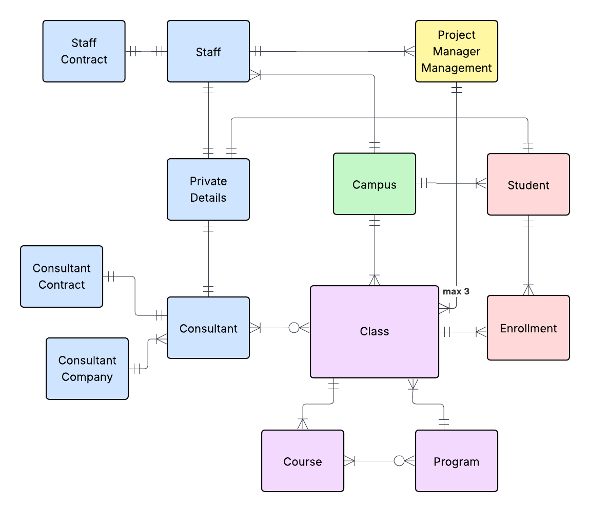

# Conceptual Model
## Goal: 
- Map out the big picture. Focus on the "things" (Entities) and how they relate (Relationships).
- **The Stakeholder / the business explicitly forbids unresolved M:N, so bridge tables are already created in a CDM level.**

## Entity Descriptions

### Conceptual ERD – Entity Descriptions

## Entity Descriptions (Easy English)

| Entity | Description |
|------|------------|
| **Student** | A person who studies at the school. A student can join one program class or up to two standalone course classes in the same term, but not both at the same time. |
| **Education Class** | A specific class offering of a program or course for a certain year and campus (for example DE 24 or AI 25). This is where teaching and student enrollment happen. |
| **Program** | A two-year education made up of several courses, including a required internship (LIA). Each program is approved multiple times, creating several education classes over the years. |
| **Course** | A standalone course with a set length, credits, and content. It is not part of a program and does not include an internship (LIA). |
| **Campus** | A physical school location where classes take place and where staff and consultants work. The model allows new campuses to be added in the future. |
| **Staff** | Employees of the school, such as program managers and administrative staff. Each staff member has one active role at a time, defined by their contract. |
| **Staff Role** | Describes the job role a staff member has during an active contract. In this model, only the Program Manager role is included, but more roles can be added later. |
| **Consultant** | External people hired to teach or support classes. Consultants work under contracts that define their role, campus, and time period. |
| **Enrollment** | Shows that one student is enrolled in one education class. It connects students to the classes they attend. |
| **Contract** | A work agreement for staff or consultants. It defines the role, campus, and time period, and allows future-dated contracts for planned hires. |
| **Private Details** | Stores sensitive personal or company information, such as personal identity numbers, contact details, and consultant company data. This information is kept separate for security reasons. |

## Relationship Description:

| Entity A | Entity B | Cardinality | Relationship Statement |
|--------|----------|------------|------------------------|
| **Program** | **Education Class** | 1 → many | One program is approved and delivered through multiple education classes over different years. |
| **Course** | **Education Class** | 1 → many | One course can be delivered through multiple education classes over time. |
| **Campus** | **Education Class** | 1 → many | One campus hosts multiple education classes. |
| **Staff** | **Contract** | 1 → 1 (active) | Each staff member has exactly one active contract at a time that defines their role and campus assignment. |
| **Consultant** | **Contract** | 1 → 1 (active) | Each consultant has exactly one active contract at a time defining their assignment and campus. |
| **Staff Role** | **Contract** | 1 → many | A staff role can be assigned to many contracts over time, but each contract defines exactly one role. |
| **Staff** | **Staff Role** | many → 1 (via Contract) | Each staff member holds exactly one role at a time, as defined by their active contract. |
| **Education Class** | **Staff (Program Manager)** | many → 1 | Each education class is managed by exactly one staff member acting as Program Manager. |
| **Staff (Program Manager)** | **Education Class** | 1 → many | One program manager is responsible for multiple education classes (minimum three). |
| **Consultant** | **Consultant Teaches** | 1 → many | One consultant can teach multiple education classes. |
| **Education Class** | **Consultant Teaches** | 1 → many | One education class can be taught by multiple consultants. |
| **Consultant Teaches** | **Consultant** | many → 1 | Each teaching assignment belongs to exactly one consultant. |
| **Consultant Teaches** | **Education Class** | many → 1 | Each teaching assignment belongs to exactly one education class. |
| **Education Class** | **Enrollment** | 1 → many | One education class has many student enrollments. |
| **Enrollment** | **Education Class** | many → 1 | Each enrollment belongs to exactly one education class. |
| **Student** | **Enrollment** | 1 → many | One student can have multiple enrollments over time, but each enrollment represents one class. |
| **Enrollment** | **Student** | many → 1 | Each enrollment belongs to exactly one student. |
| **Student** | **Private Details** | 1 → 1 | Each student has exactly one set of private personal information. |
| **Staff** | **Private Details** | 1 → 1 | Each staff member has exactly one set of private personal information. |
| **Consultant** | **Private Details** | 1 → 1 | Each consultant has exactly one set of private personal or company-related information. |

