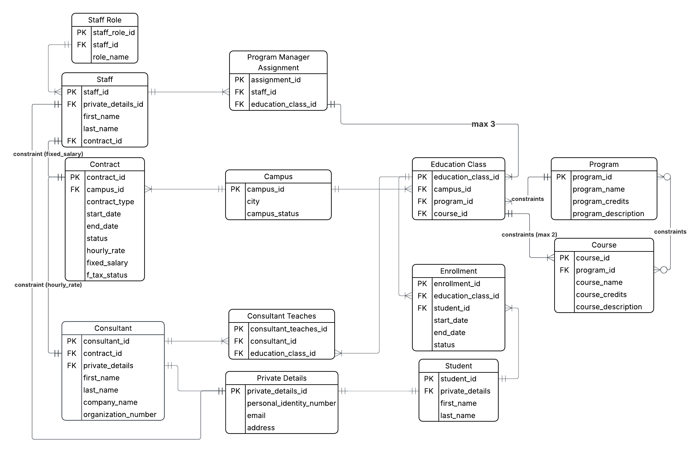

# Logical Model & Normalization (1NF -> 2NF -> 3NF)
## Goal: 
- Refine the conceptual model into a formal structure. This is where I define primary keys and ensure my tables are organized efficiently.

## Normalization Step: 
- Apply 3NF here to eliminate redundancy (e.g., ensuring a student's address isn't repeated for every course they take)

## 1NF: 
- Remove duplicate columns and ensure "atomic" values66

## 2NF: 
- Ensure all attributes depend on the whole primary key77.

## 3NF: 
- Ensure attributes depend only on the primary key (no transitive dependencies).