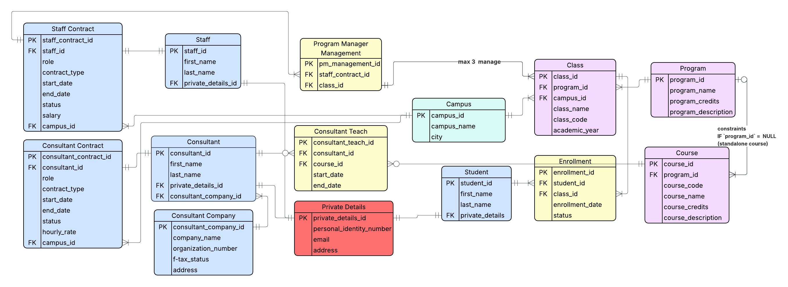

# Logical Model & Normalization (1NF -> 2NF -> 3NF)
## Goal: 
- Refine the conceptual model into a formal structure. This is where I define primary keys and foreign keys and ensure my tables and attributes are 3NF validated.

